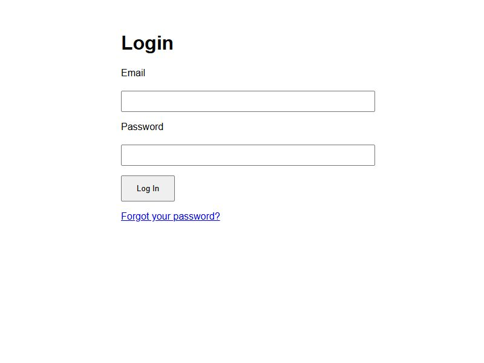

# Participant Documentation

This guide will help you understand how to use the Conversational AI: Conflict Club platform as a participant. It covers all the main features and actions you can take within the system.

## Table of Contents

1. [Logging In](#logging-in)
2. [Main Interface Overview](#main-interface-overview)
3. [User Menu](#user-menu)
4. [Working with Conversations](#working-with-conversations)
5. [Working with Courses](#working-with-courses)
6. [Sending and Responding to Messages](#sending-and-responding-to-messages)
7. [Using Comments](#using-comments)

## Logging In

To access the Conversational AI platform, you need to log in with your credentials.

1. Enter your email address in the "Email" field
2. Enter your password in the "Password" field
3. Click the "Log In" button
4. If you've forgotten your password, click the "Forgot your password?" link at the bottom of the form

## Main Interface Overview

After logging in, you'll see the main interface which consists of several key areas:

The interface shows the Conversational AI platform with "Conflict Club" branding in the header. The screenshot displays the main application interface with the conversation list on the left and the selected conversation content on the right.

1. **Header Bar**: Contains the application title and your user menu
2. **Left Sidebar**: Lists your conversations and courses
3. **Main Content Area**: Displays the selected conversation or course content
4. **Message Input Area**: Located at the bottom of the main content area for typing messages

## User Menu

The user menu is located in the top-right corner of the screen, showing your username.

1. Click on your username to open the dropdown menu
2. The dropdown menu contains:
   - **Groups**: List of groups you belong to
   - **LLMs**: List of available Large Language Models
   - **Log out**: Option to log out of the system

### Selecting a Group

1. Click on your username in the top-right corner
2. In the dropdown menu, find the "Groups" section
3. Click on the group you want to select
4. The interface will update to show conversations and courses for that group

### Selecting an LLM

1. Click on your username in the top-right corner
2. In the dropdown menu, find the "LLMs" section
3. Click on the LLM you want to use
4. Your selection will be saved and used for future conversations

### Logging Out

1. Click on your username in the top-right corner
2. Click "Log out" at the bottom of the dropdown menu
3. You will be redirected to the login screen

## Working with Conversations

Conversations allow you to interact with AI assistants in a chat-like interface.

In the conversation screen, you can see:
- The conversation title at the top of the main content area
- Messages from you (on the left, with a light cyan background)
- Responses from the AI assistant (on the left, with a light gray background)
- A text input area at the bottom where you can type your messages

### Viewing Conversations

1. Your conversations are listed in the left sidebar under the "Conversations" heading
2. Each conversation shows its name
3. The currently selected conversation is highlighted

### Creating a New Conversation

1. Click the "New Conversation" button at the bottom of the Conversations section
2. Enter a name for your new conversation when prompted
3. The new conversation will be created and automatically selected

### Selecting a Conversation

1. Click on any conversation in the list to select it
2. The main content area will update to show the conversation history
3. You can now send messages in this conversation

## Working with Courses

Courses are structured learning experiences within the platform.

The course screen has a similar layout to the conversation screen, but it's focused on structured learning content rather than free-form conversation.

### Viewing Courses

1. Your courses are listed in the left sidebar under the "Courses" heading
2. Each course shows its name
3. The currently selected course is highlighted

### Creating a New Course

1. Click the "New Course" button at the bottom of the Courses section
2. Enter a name for your new course when prompted
3. The new course will be created and automatically selected

### Selecting a Course

1. Click on any course in the list to select it
2. The main content area will update to show the course content
3. You can now interact with the course materials

## Sending and Responding to Messages

Once you've selected a conversation, you can send messages and view responses.

### Sending a Message

1. Click in the message input area at the bottom of the main content area
2. Type your message
3. Press Enter or click the "Send" button to send your message
4. Your message will appear in the conversation, and the AI will respond shortly

### Message Formatting

You can use basic formatting in your messages:
- **Bold text**: Surround text with double asterisks (`**bold**`)
- *Italic text*: Surround text with single asterisks (`*italic*`)
- `Code`: Surround text with backticks (`` `code` ``)

The AI assistant may also use formatting in its responses to highlight important information or structure its answers.

## Using Comments

You can add comments to any message in a conversation.

### Adding a Comment

1. Click the "comment" link below any message (visible at the bottom of each message)
2. A comment input area will appear below the message
3. Type your comment in the text area
4. Click the "Submit" button to add your comment
5. Your comment will appear indented below the original message with a slight left border to distinguish it from regular messages

### Viewing Comments

Comments appear indented below the message they're associated with, making it easy to follow discussion threads within a conversation.

---

If you have any questions or need further assistance, please contact your system administrator.